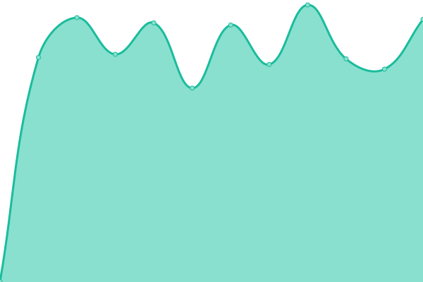

# [📈 Live Status](https://pierrelepetit.com): <!--live status--> **Tous les systèmes sont opérationnels**

This repository contains the open-source uptime monitor and status page for [Upptime](https://upptime.js.org), powered by [Upptime](https://github.com/upptime/upptime).

With [Upptime](https://upptime.js.org), you can get your own unlimited and free uptime monitor and status page, powered entirely by a GitHub repository. We use [Issues](https://github.com/upptime/upptime/issues) as incident reports, [Actions](https://github.com/pilep/kanta-uptime/actions) as uptime monitors, and [Pages](https://pierrelepetit.com) for the status page.

<!--start: status pages-->
<!-- This summary is generated by Upptime (https://github.com/upptime/upptime) -->
<!-- Do not edit this manually, your changes will be overwritten -->
<!-- prettier-ignore -->
| URL | Status | History | Response Time | Uptime |
| --- | ------ | ------- | ------------- | ------ |
|  [Kanta API - Production](https://app.kanta.fr/api) | En ligne | [kanta-api-production.yml](https://github.com/PiLep/kanta-uptime/commits/HEAD/history/kanta-api-production.yml) | 

 772ms
     
 | 

<a href="https://status.kanta.fr/history/kanta-api-production">100.00%</a>
    

|  [Kanta Front - Production](https://app.kanta.fr) | En ligne | [kanta-front-production.yml](https://github.com/PiLep/kanta-uptime/commits/HEAD/history/kanta-front-production.yml) | 

 147ms
     
 | 

<a href="https://status.kanta.fr/history/kanta-front-production">100.00%</a>
    

|  [Kanta API - Preprod](https://preprod.kanta.fr/api) | En ligne | [kanta-api-preprod.yml](https://github.com/PiLep/kanta-uptime/commits/HEAD/history/kanta-api-preprod.yml) | 

 742ms
     
 | 

<a href="https://status.kanta.fr/history/kanta-api-preprod">100.00%</a>
    

|  [Kanta Front - Preprod](https://preprod.kanta.fr) | En ligne | [kanta-front-preprod.yml](https://github.com/PiLep/kanta-uptime/commits/HEAD/history/kanta-front-preprod.yml) | 

 147ms
     
 | 

<a href="https://status.kanta.fr/history/kanta-front-preprod">100.00%</a>
    

<!--end: status pages-->

[**Visit our status website →**](https://pierrelepetit.com)

## 📄 License

- Powered by: [Upptime](https://github.com/upptime/upptime)
- Code: [MIT](./LICENSE) © [Upptime](https://upptime.js.org)
- Data in the `./history` directory: [Open Database License](https://opendatacommons.org/licenses/odbl/1-0/)
